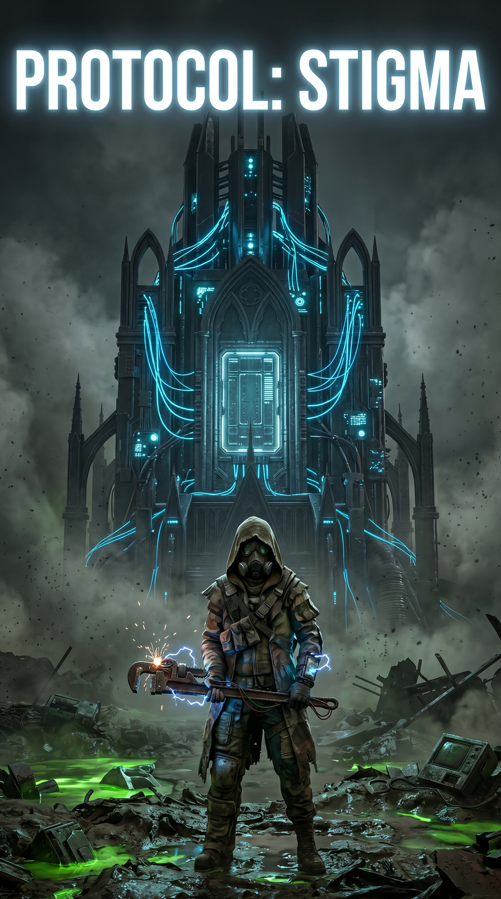
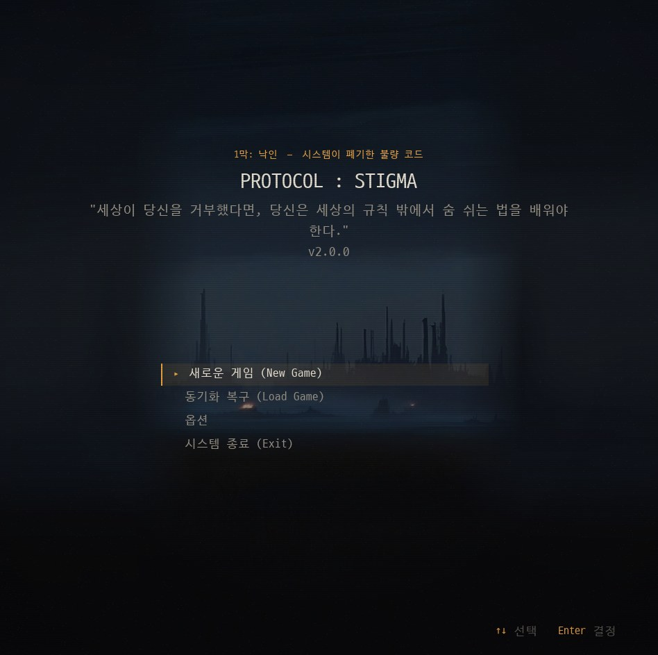
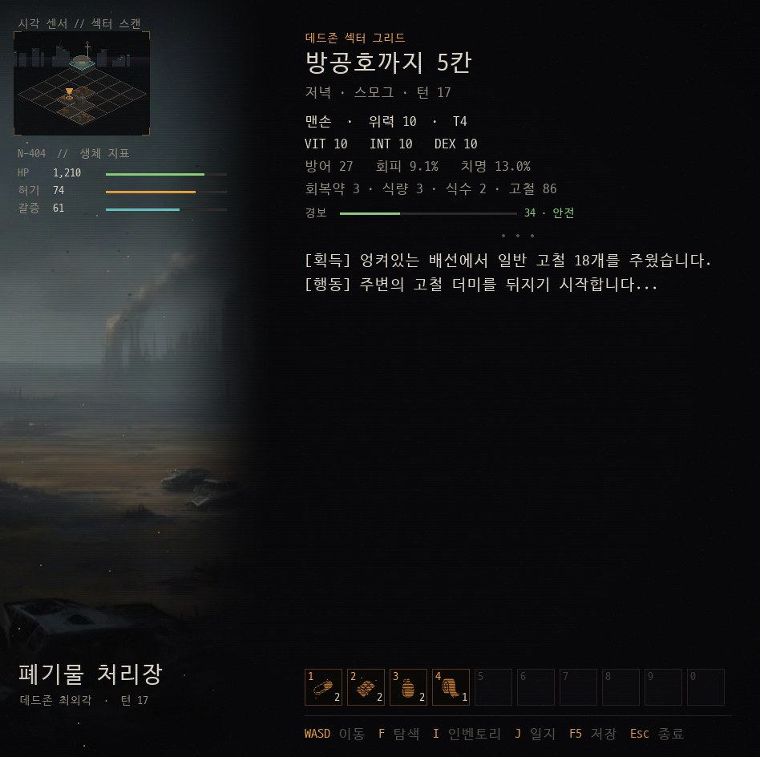
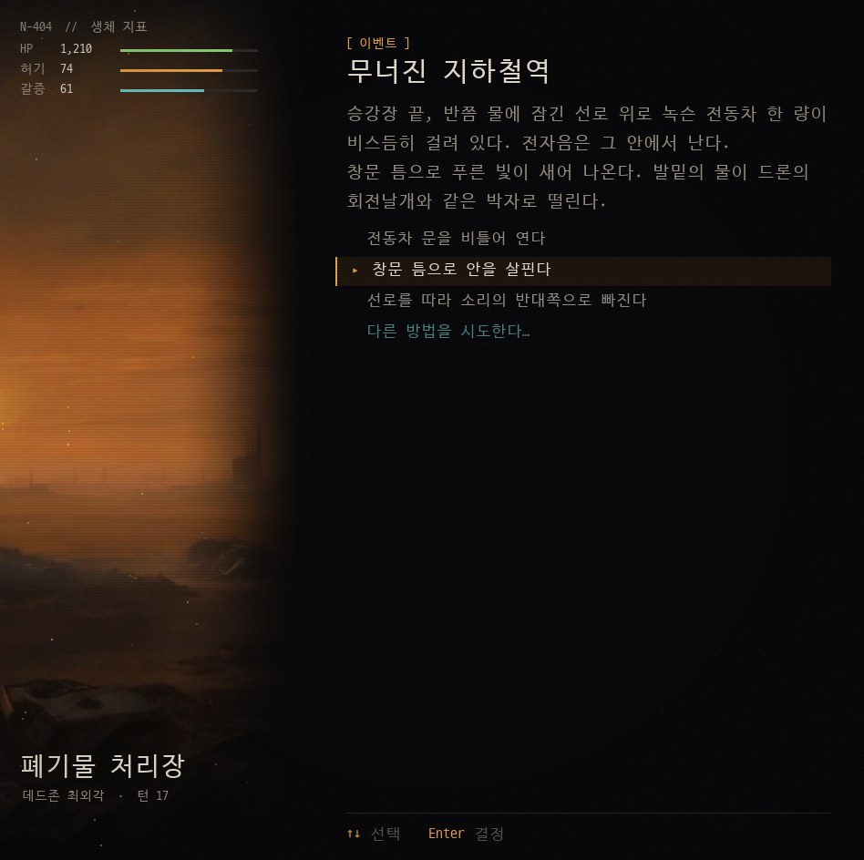
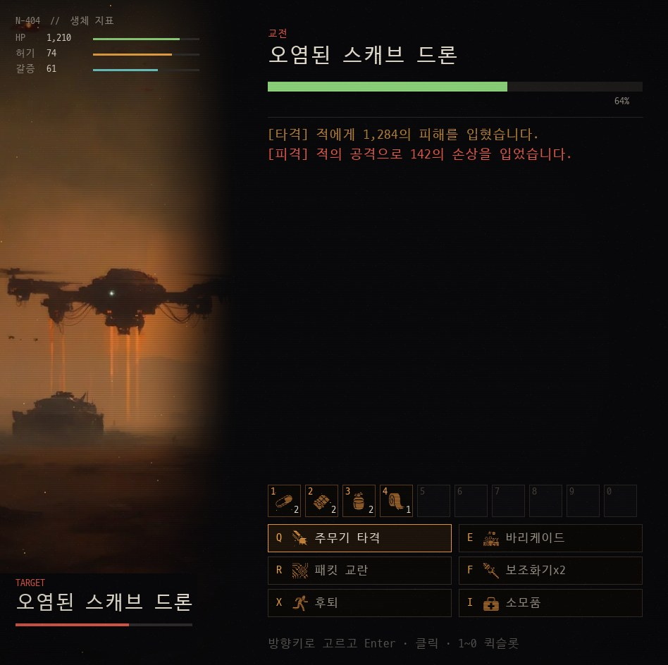
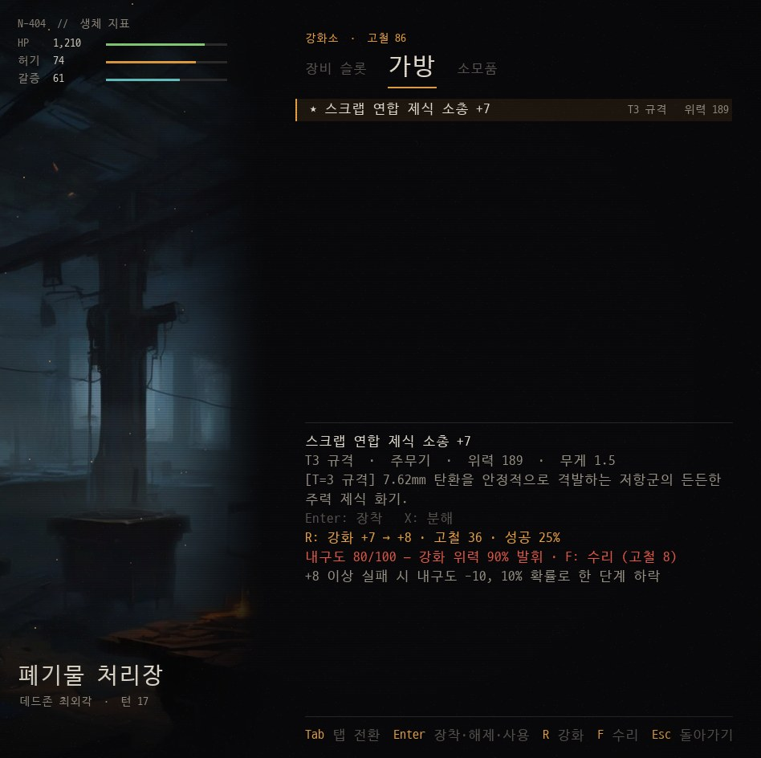

# PROTOCOL: STIGMA — 1막: 낙인

> 시스템이 폐기한 불량 코드 **N-404**가 되어 데드존에서 살아남고, 첫 거점을 선언하기까지.
> **하드코어 생존 사이버펑크 텍스트 RPG** — 그림이 무대를 깔고, 이야기는 글로 벌어진다.



**[최신 버전 받기](../../releases/latest)** · Windows 10/11 · macOS (Apple Silicon) · 한국어 / English · 약 90분

---

## 어떤 게임인가

- **글이 주인공인 RPG.** 장면 그림과 소리가 분위기를 깔고, 사건은 글로 읽고 고른다. 선택지에 정답 힌트는 없다
- **내 PC에서 도는 이야기꾼.** 동적 서사를 켜면 게임 안의 로컬 AI가 탐색과 사건을 매번 새로 쓰고 판정한다. 선택지에 없는 행동도 **직접 써서** 할 수 있다. 인터넷 연결이 필요 없다
- **버티는 생존.** 허기 · 갈증 · 경계 · 칸마다 한정된 수색. 시작 장비로는 보스를 이길 수 없다 — 모으고, 강화하고, 준비해야 한다
- **선택이 나를 만든다.** 고른 행동이 물리 격돌 · 자원 정제 · 연산 침투 성향으로 쌓이고, 마지막 선택과 함께 각성 직업과 엔딩이 정해진다

## 스크린샷

| | |
|---|---|
|  |  |
| 타이틀 | 탐색 — 2.5D 섹터 스캔, 생체 지표, 퀵슬롯 |
|  |  |
| 이벤트 — 글을 읽고 고르거나 직접 행동을 쓴다 | 전투 — Q·E·R·F 기술, 1~0 퀵슬롯 |
|  | |
| 발칸 게이츠의 강화소 — +10까지, 실패의 대가 | |

## 세계

- **네오 아크 (5%)** — 마스터 AI와 지배 계급이 통제하는 초고도 가상 도시. 인류의 95%를 격리하라는 연산 결과로 세워졌다
- **데드존 (95%)** — 방사능 폭풍과 기계 괴수가 도는 아날로그 폐허. 구시대 유물이 묻힌 기회의 땅이기도 하다
- 당신은 네오 아크 실험실에서 '불량 코드'로 분류되어 데드존 최외각 **폐기물 처리장**에 버려졌다. 안전 구역은 어디에도 없다

**1막 「낙인」** — 5×5 섹터를 탐색하며 허기와 갈증을 버티고, 구시대 지하 방공호에 닿아, 몰려오는 분쇄 기계 **스캐브 컬렉터**를 15턴 안에 멈춰 첫 거점을 선언한다.

1. **자아 부팅** — 시각 센서가 켜지고, 움직일 때마다 줄어드는 생존 수치를 익힌다
2. **행위 기록 수집** — 쓰레기 바다를 뒤져 급조 장비를 모으고, 생존 방식을 묻는 선택을 마주한다
3. **데드라인 경보** — 방공호를 찾은 순간, 컬렉터가 안식처를 향해 돌진해 온다
4. **보루전과 각성** — 보스를 쓰러뜨리고 드러난 동력 코어를 어떻게 처분할지 고른다

---

## 설치와 실행

**Windows**
1. [릴리스 페이지](../../releases/latest)에서 `PROTOCOL_STIGMA_win64.zip`을 받는다
2. 압축을 풀고 폴더 안의 `PROTOCOL_STIGMA.exe`를 실행한다
3. "Windows의 PC 보호" 창이 뜨면 **추가 정보 → 실행** (코드 서명을 하지 않은 개인 프로젝트라서 뜨는 경고다)

**macOS (Apple Silicon)**
1. [릴리스 페이지](../../releases/latest)에서 `PROTOCOL_STIGMA_mac.tar.gz`를 받는다
2. 터미널에서:
   ```bash
   tar -xzf PROTOCOL_STIGMA_mac.tar.gz
   chmod +x PROTOCOL_STIGMA
   ./PROTOCOL_STIGMA
   ```
3. "확인되지 않은 개발자" 경고가 뜨면 **시스템 설정 → 개인정보 보호 및 보안 → 그래도 열기**
4. 동적 서사는 아직 Windows 전용이다. Mac에서는 기본 대본으로 진행된다 (Mac 지원 준비 중)

**소스에서 실행** (Python 3.10+)
```bash
pip install pygame-ce rich colorama cryptography   # cryptography는 진단 기록용 (없어도 실행된다)
cd 개발
python Main.py
```

## 조작

**WASD 이동 · Q·E·R·F 기술 · I 인벤토리 · 1~0 퀵슬롯 · Esc 뒤로.**
모든 화면에서 방향키로 고르고 Enter로 실행하며, 마우스로 눌러도 된다. 화면 아래 조작 안내도 버튼이다.

| 맵 | | 전투 | |
|---|---|---|---|
| W A S D | 이동 (미니맵 옆 칸 클릭도) | Q | 주무기 공격 |
| F | 탐색 | E | 바리케이드 |
| I | 인벤토리 | R | 패킷 우회 교란 |
| E | 발칸 게이츠 · 강화소 | F | 보조 화기 |
| J | 항법 일지 | Z / C | 스킬 |
| 1 ~ 0 | 퀵슬롯 | X | 후퇴 |
| F5 | 저장 | I · 1~0 | 소모품 |

전체 조작과 규칙·수치는 **[게임 가이드](docs/GUIDE.md)**에 있다.

## 시스템 요구 사양

**기본 게임**

| | 최소 | 권장 |
|---|---|---|
| OS | Windows 10 64비트 / macOS 12 (Apple Silicon) | Windows 10·11 64비트 |
| CPU | 64비트 2코어 | 4코어 이상 |
| 메모리 | 4GB | 8GB |
| 저장 공간 | 300MB | 300MB |
| 화면 | 1366×768 | 1920×1080 |

**동적 서사** (선택, Windows 전용 · 위 사양에 더해)

| 모드 | 추가 데이터 | 최소 | 권장 |
|---|---|---|---|
| 가벼움 | 1.5GB | 그래픽 메모리 2GB, 메모리 8GB | 그래픽 메모리 4GB 이상 |
| 고품질 | 4.9GB | 그래픽 메모리 6GB (GTX 1660 · RTX 2060 · RX 5600 XT급), 메모리 8GB | 그래픽 메모리 8GB 이상 (RTX 3060 · RX 6600급), 메모리 16GB |

- CPU가 AVX2를 지원해야 한다 (Intel 4세대 코어 · AMD 라이젠 이후). NVIDIA · AMD · Intel 그래픽 모두 된다
- 내장 그래픽 노트북은 메모리를 나눠 쓰므로 고품질은 메모리 16GB 이상에서
- 그래픽 메모리가 모자라면 CPU로 돌아 한 턴이 많이 느려진다 → 가벼움을 고른다
- 참고: RTX 3060에서 한 턴 고품질 2~2.5초, 가벼움 1.2~1.4초
- 켜는 법: **옵션 → 동적 서사**. 처음 켤 때 추가 데이터를 받을지 묻는다

## 문제 해결

| 증상 | 해결 |
|---|---|
| 실행하면 "Windows의 PC 보호" | **추가 정보 → 실행**. 서명하지 않은 exe라서 뜬다 |
| 백신이 exe를 막는다 | 오탐이다. 게임 폴더를 예외에 넣거나 백신 회사에 오탐 신고. 걱정되면 소스에서 실행 |
| Mac에서 "열 수 없음" | 시스템 설정 → 개인정보 보호 및 보안 → **그래도 열기** |
| 동적 서사가 안 나온다 | 설치 후 첫 실행은 준비에 수십 초 걸린다(그동안 대본). 영어 모드와 Mac은 대본이 정상 |
| 소리가 안 난다 | 옵션의 음소거·음량 확인. 사운드 장치가 없으면 무음으로 진행된다 |
| 저장 파일 위치 | 게임 폴더의 `stigma_save.json`, 설정은 `settings.json` |

**버그 제보**: [Issues](../../issues)에 증상과 함께 게임 폴더 `diag/`의 최근 `.sdg` 파일을 올려 주세요. 오류 추적 기록이며, 암호화돼 있어 개발자만 읽을 수 있습니다.

---

## 크레딧

- 제작: **rorena15** — 기획 · 프로그래밍 · 시나리오
- 음악: Christian Fernando Perucchi (Godot TPS Demo) · HorrorPen "Loop - House in a Forest" — CC BY 3.0
- 효과음: Godot TPS Demo (Juan Linietsky, Fernando Miguel Calabró, CC BY 3.0) · Kenney · Freesound · uisfx (CC0)
- 아이콘: game-icons.net — Lorc, Delapouite, Sbed, Rihlsul (CC BY 3.0)
- 글꼴: D2Coding (NAVER) · Noto Emoji (Google) — SIL OFL 1.1
- 동적 서사: Kakao Kanana 1.5를 파인튜닝한 모델 (Apache 2.0) · llama.cpp (MIT)
- 장면 그림: 로컬 Stable Diffusion XL로 생성

전체 출처와 라이선스 전문은 게임의 **옵션 → 크레딧 · 라이선스**와 [`assets/licenses/`](assets/licenses/)에 있다.

## 개발

- 빌드 · 구조 · 동적 서사 내부: [개발/BUILD.md](개발/BUILD.md)
- GM 모델 (학습 · 평가 · 배포): [stigma-gm/README.md](stigma-gm/README.md), Mac 지원 검토: [stigma-gm/MAC_GM.md](stigma-gm/MAC_GM.md)
- 기획 문서: [기획/](기획/) — 다음 버전 계획은 [v2.1 개발안](기획/v2.1_개발안.md)
- 변경 내역: [RELEASE_NOTES.md](RELEASE_NOTES.md)

| 항목 | 내용 |
|---|---|
| 상태 | 1막 「낙인」 데모 — v2.0.0 |
| 엔딩 | 기본 3종 + 히든 1종, 1막 뒤 2막 티저 |
| 라이선스 | 개인 프로젝트 (Personal Project). 게임에 포함된 서드파티 에셋·라이브러리는 각자의 라이선스를 따른다 |

**기획 중 (2막 이후)**: 거점 개척과 습격(레이드), 방어구·장신구 강화와 재료, 성향·진영 평판, 네오 아크 잠입
