# v2.1 개발안

v2.0.0(강화·강화소 퀘스트·적 종류·사운드·크레딧·조작 개편·퀵슬롯)을 바탕으로 한 다음 버전 계획.
결정이 필요한 항목은 **[결정]**, 본집 개발 PC(Windows, SDXL·학습 환경·키 보관)에서만 할 수 있는 일은 **[PC]**,
클라우드 세션에서 할 수 있는 일은 **[여기]**로 표시한다.

---

## 0. 원칙

- **이 게임의 정체성은 글이다.** 파인튜닝한 GM의 서술, 플레이어가 직접 쓰는 행동, 항법 일지.
  그림은 무대이고, 이야기가 시작되면 글에 자리를 내준다.
- 보는 맛은 **탐색**에서, 특색은 **이야기**에서 살린다.
- 선택지에 번호·능력치·결과 힌트를 붙이지 않는다. 방향키·클릭으로 고르고 숫자키는 보이지 않는 단축키.
- UI 톤은 N-404 시각 센서: 주황 단색 아이콘, 주사선, 가끔 지직이는 잡음, 모서리 꺾쇠. 네온 빛 번짐은 쓰지 않는다.
- 조작: WASD 이동 · QERF 기술 · I 인벤토리 · 1~0 퀵슬롯 · Esc 뒤로. 마우스·방향키는 모든 화면에서.

---

## 1. 화면 방향 [결정]

목업: `docs/기획/정면뷰_목업/` (README에 파일별 설명)

**현재 v2.0 화면**

| | |
|---|---|
|  |  |

**B안 (최소 HUD)**

| 탐색 | 전투 | 대화 |
|---|---|---|
| 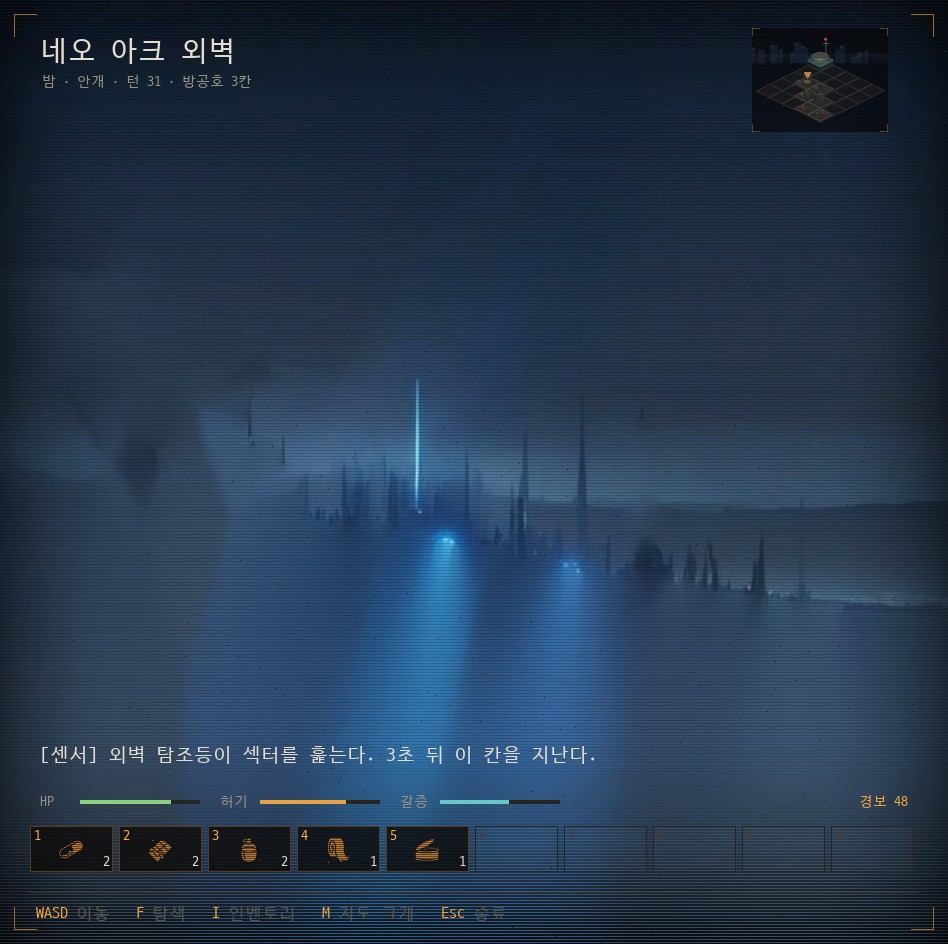 | 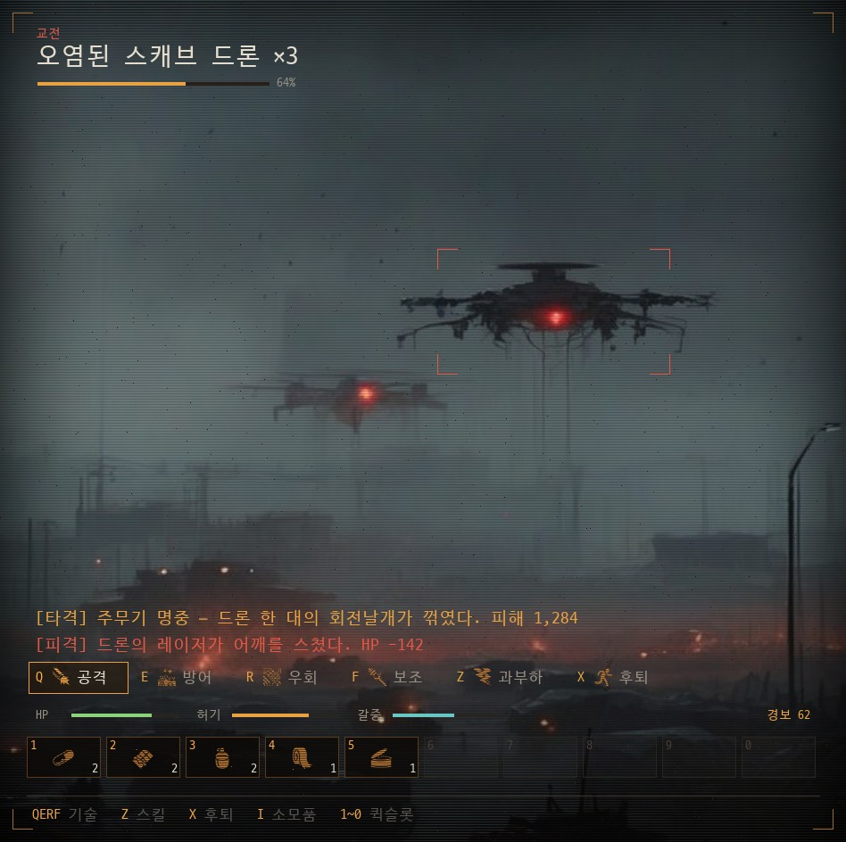 | 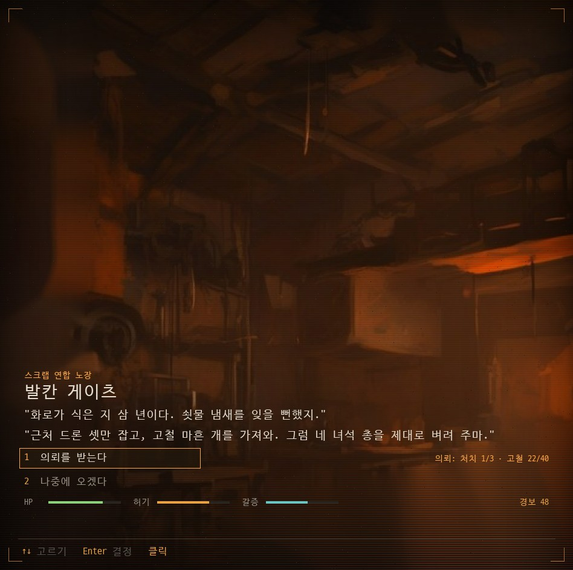 |

**C안 (절충안)**

| 탐색 | 이야기 시작 | 직접 입력 |
|---|---|---|
| 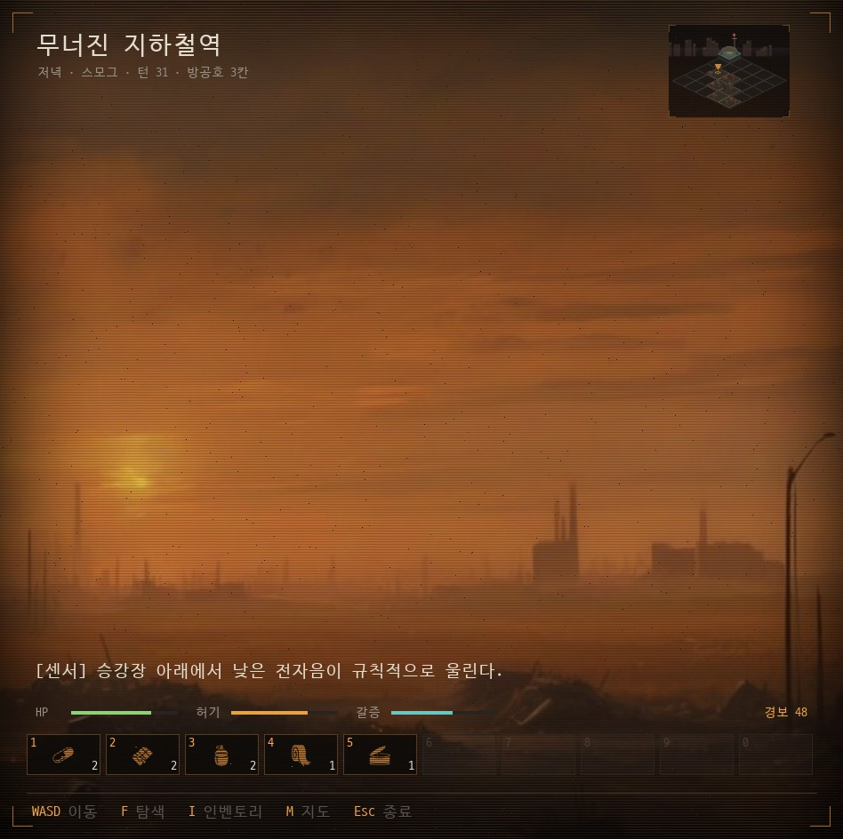 | 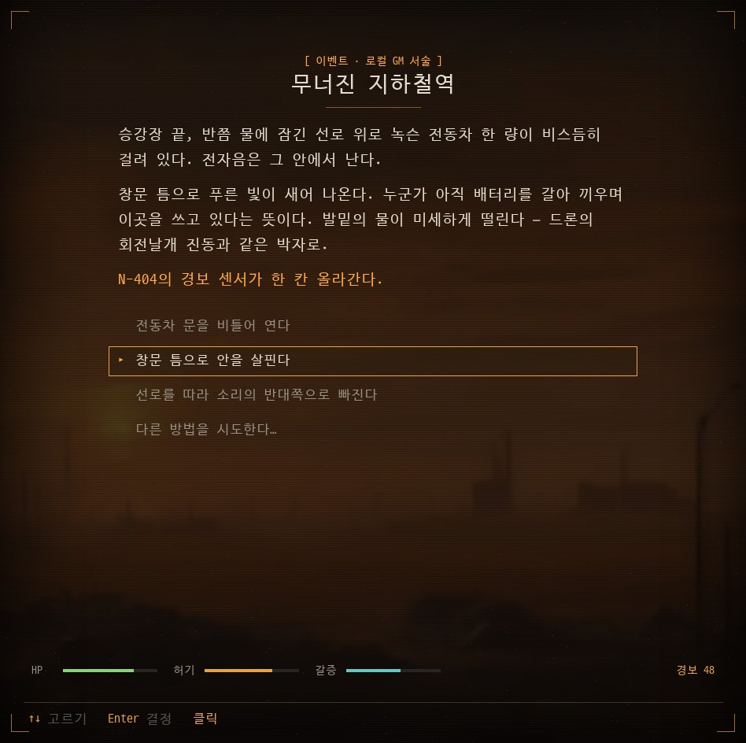 | 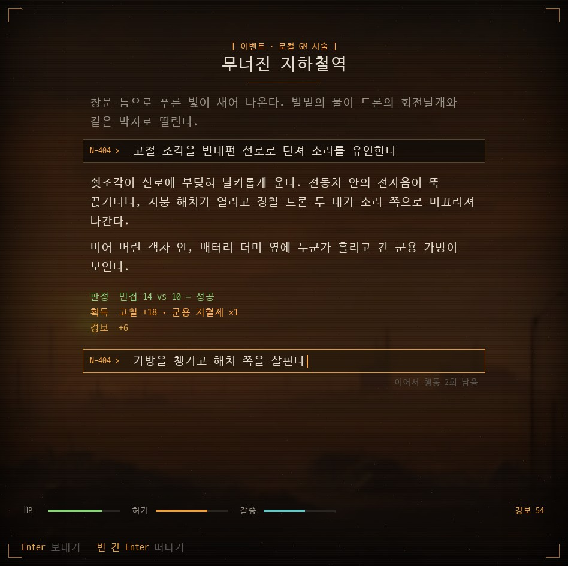 |

**참고 (패널형 비교안)**

| | | |
|---|---|---|
| 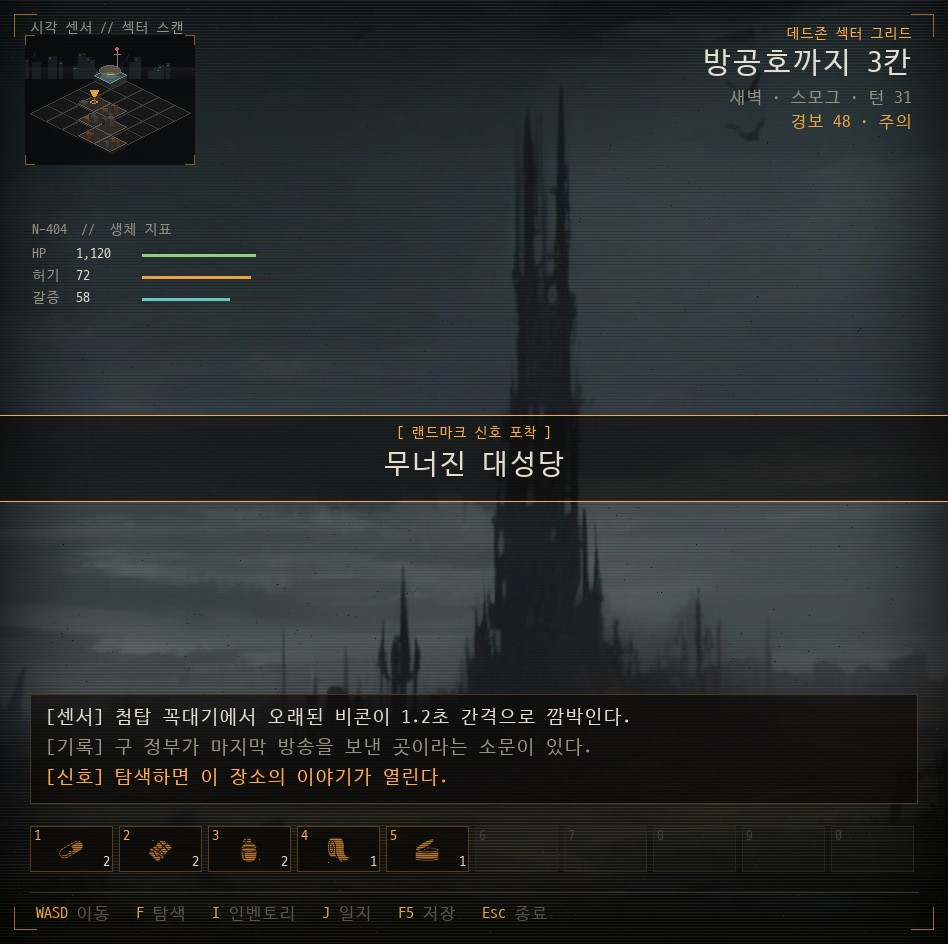 | 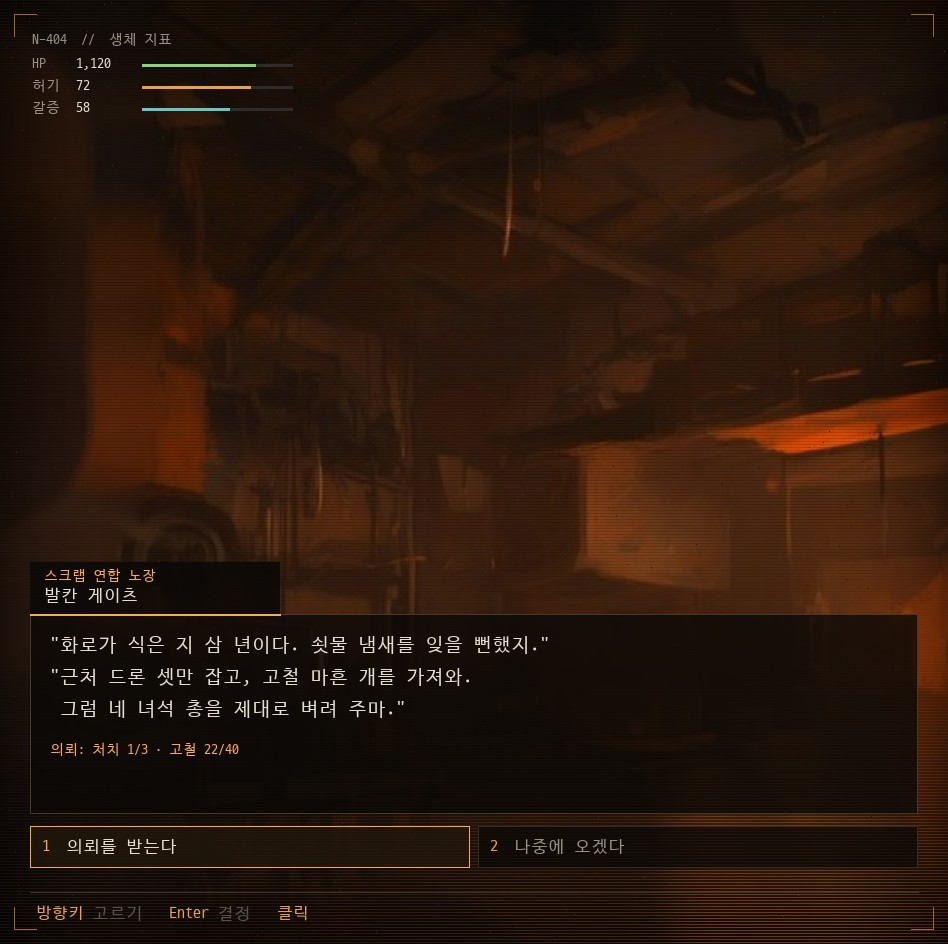 | 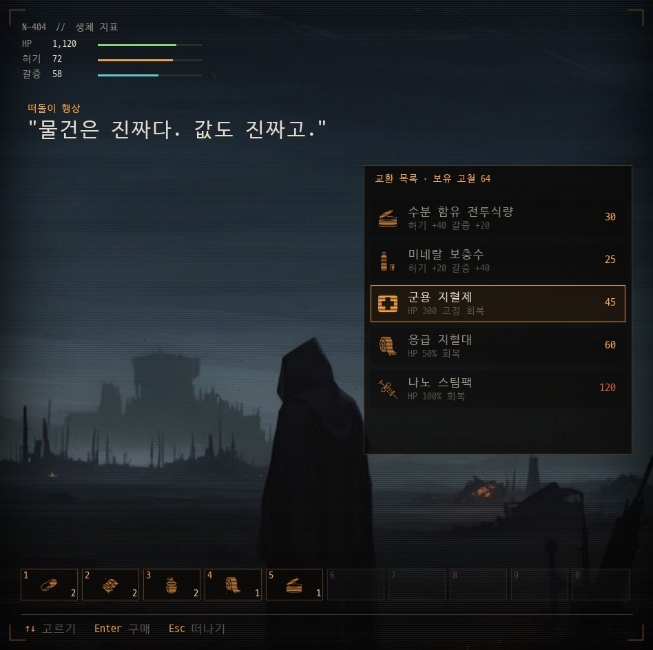 |
| 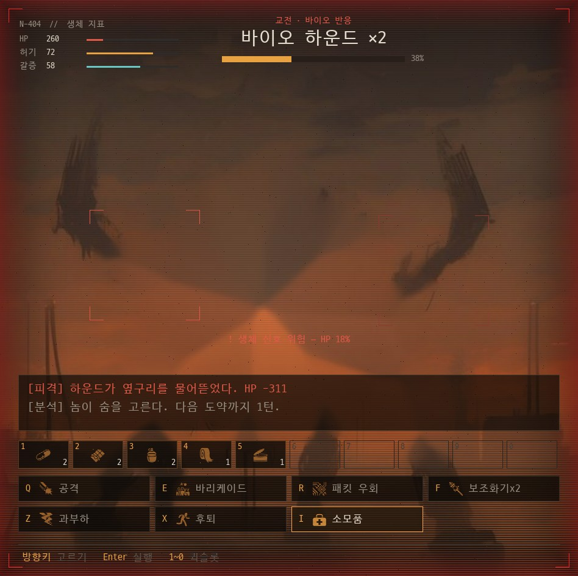 | 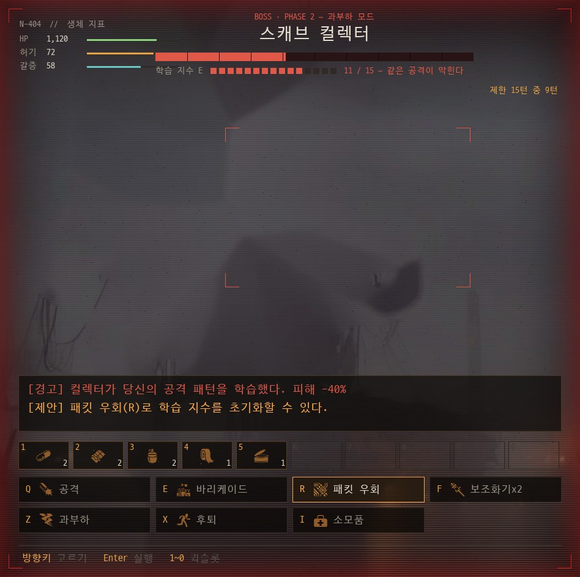 | |

| 안 | 요약 | 장점 | 단점 |
|---|---|---|---|
| A. 2.0 유지 | 왼쪽 세로 장면 판 + 오른쪽 글 칸 | 특색이 가장 분명, 추가 작업 없음 | 보는 맛이 약함 |
| B. 최소 HUD 정면 뷰 | 그림 가득 + 아래 띠 UI | 몰입감·보는 맛 최고 | 글이 두 줄 기록으로 줄어 텍스트 RPG 특색 약화 |
| C. 절충안 (권장) | 탐색·전투는 B, **이야기가 시작되면 그림이 흐려지며 물러나고 글이 가운데를 책 페이지처럼 차지** | 둘 다 살림, GM 서술이 2.0보다 더 크게 보임 | 구현량이 가장 많음 |

### C안 화면 설계 (고르면 이대로 구현)

| 상태 | 배경 | 글 | UI |
|---|---|---|---|
| 탐색 | 칸의 장면 그림 가득, 이동 연출(W 다가감, A/D 밀림)은 지금 코드 재사용 | 왼쪽 위 지명·시간·날씨, 아래 센서 한 줄 | 아래 띠: 지표 · 퀵슬롯 · 조작 안내, 오른쪽 위 작은 미니맵(M으로 크게) |
| 전투 | 적 교전 그림 가득 + 조준 꺾쇠 | 기록 두 줄 | 행동 한 줄(Q·E·R·F·Z·X), 지표, 퀵슬롯 |
| 이야기 (이벤트·GM·NPC) | 같은 그림을 흐리고 어둡게 | 가운데 책 페이지: 태그 · 제목 · 서술(타자 연출) · 선택지 · "다른 방법을 시도한다…" | 아래 지표 한 줄, 조작 안내 |
| 직접 입력 | 이야기와 같음 | `N-404 >` 입력 줄 → GM 서술 → 판정·획득·경보 줄 | 남은 행동 수 |

화면 전환은 지금의 크로스페이드(`gui._crossfade`)를 쓰고, 이야기 진입 때만 배경 흐림을 0.3초에 걸쳐 올린다.

### 구현 단계 (C안 기준)

1. **공용 배경 층** [여기]: 장면 그림을 화면 가득 깔고 등급(위아래 어둡게·주사선·비네트·잡음) 적용. 목업의 `art()` / `grade()`를 게임 코드로 옮긴다.
2. **탐색 화면** [여기]: `map_view.MapView`를 새 배치로. 미니맵 축소·M 확대, 아래 띠 UI.
3. **이야기 화면** [여기]: `event_view.EventView`의 오른쪽 글 칸을 가운데 책 페이지로. 선택지·입력·결과 토큰은 지금 코드 재사용.
4. **전투 화면** [여기]: `combat_view.CombatView`를 새 배치로. 행동 한 줄 + 퀵슬롯.
5. **남은 글 화면 옮기기** [여기] (2절).
6. **적 그림 교체** [PC] (3절). 교체 전까지는 지금 교전 그림을 흐리게 깔고 쓴다.
7. **플레이 검증** [PC]: 1366×768 노트북, 전체 화면, 마우스만으로 한 판.

---

## 2. 남은 글 화면 → 그림 화면 [여기]

지금도 그림 창 안에서 검은 바탕에 글만 찍히는 화면들. 번호 `[1]`이 남아 있다 (방향키·클릭은 됨).

| 화면 | 위치 | 옮길 형태 |
|---|---|---|
| 보스전 직전 준비 (소모품 · 저장 · 돌입) | `Main.py` 보스 칸 진입 | 이야기 화면 + 선택지 |
| 소모품 목록 (보스 준비에서) | `player.use_consumable_menu` | 인벤토리 소모품 탭을 바로 열기 |
| 보스 코어 선택 | `story.run_boss_core_choice` | 이야기 화면 + 선택지 |
| 외곽 조우 | `story.run_perimeter_encounter` | 이야기 화면 + 선택지 |
| 2막 신호 | `story` act2 신호 | 이야기 화면 + 선택지 |
| 대본 모드 선택 이벤트 (GM 끔) | `quest.handle_random_event` choice | 이야기 화면 + 선택지 |

A안(2.0 유지)을 골라도 이 작업은 한다: 화면 톤이 하나로 맞고, 보스 직전 같은 중요한 순간이 밋밋하지 않게.

---

## 3. 에셋

### 3-1. 적 교전 그림 새로 뽑기 [PC] (B·C안이면 필수)

지금 `assets/scenes/enemy_*`는 흐리고 뭉개져 화면 가득 키우면 적이 형체가 없다.

- 대상: 스캐브 드론 · 바이오 하운드 · 들개 무리 · 청소 부대 · 스캐브 컬렉터(보스) — 각 2~4장(시간대·날씨 변형)
- 비율: **가로 또는 정사각** (예: 1344×768 뽑아서 화면 비율 948×944에 맞춰 자름). 지금 세로(576×1600) 설정과 따로 둔다
- 구도: 적이 가운데 1/3 안에 선명하게, 배경은 지금 화풍(세피아·저채도·스모그)
- 도구: `개발/art_gen/gen_scenes.py`에 `enemy` 모드 추가 [여기] → 실행·고르기 [PC]
- 조준 꺾쇠 위치: 그림마다 적 중심·크기를 `assets/scenes/enemy_*/aim.json`에 적는다 [PC, 고를 때]

### 3-2. 배경 그림 (C안의 탐색 화면)

- 지금 세로 그림을 가운데 잘라 1.6배 키우면 조금 흐리다. 급하지 않다 — 탐색 화면을 먼저 만들고 흐린 칸부터 가로로 다시 뽑는다 [PC]

### 3-3. 아이콘

- game-icons.net (CC BY 3.0) — 이미 소모품 11 + 전투 행동 8. 새 소모품·행동이 생기면 같은 방식으로 추가하고 `assets/icons/CREDITS.md`와 게임 안 크레딧을 같이 고친다

---

## 4. Mac 지원 (GM 포함)

자세한 내용과 결정 항목: `stigma-gm/MAC_GM.md`

- 지금 Mac 빌드에는 GM이 없다 (대본 모드만). 실행기 패치가 Windows 전용이었기 때문.
- 패치의 Mac·Linux 지원: **완료**. Linux에서 로드·생성까지 확인했다.
- Mac 실행기 CI(`.github/workflows/mac-gm-runtime.yml`): 만들어 둠, 아직 돌리지 않음 [PC에서 실행]
- Mac 실행기 빌드는 GitHub Actions Mac 러너에서 (Mac 기기 없음). 배포용 설정은 저장소 Secret으로.
- Mac 빌드를 PyInstaller `--onefile`에서 `.app` 폴더형으로.
- Mac GM은 릴리스 노트에 **베타**. Metal 속도·16GB 풀 모델 동작은 Mac 사용자 제보로 확인.

---

## 5. GM·서사 (보류 항목)

v2.0에서 "고민이 필요"로 미뤄 둔 것. 착수 전에 방향을 정한다 [결정].

- **GM 로어 조각**: 발칸 게이츠·강화소·들개·청소 부대·날씨 같은 새 요소를 `개발/gm/lore_snippets.json`에 추가해 GM이 알게 한다
- **일지용 게임 이벤트 표**: 진단 기록(암호화)과 분리된, 일지가 참조할 수 있는 플레이 기록. 개인정보·용량 원칙부터 정한다

---

## 6. 배포

- **코드 서명**: 당장은 하지 않는다 (비용). Windows SmartScreen은 "추가 정보 → 실행", Mac Gatekeeper는 우클릭 → 열기를 README·릴리스 노트에 안내
- Windows는 이미 폴더형(`--standalone`) 배포. `legacy_exe`(단일 exe)는 1.9.x 업데이터 전환이 끝났으면 그만 만든다 [결정]
- 수익이 생기면: Windows 서명(저가 인증서), Apple 개발자 등록($99/년, 공증)

---

## 7. 진행 순서 (제안)

| 순서 | 작업 | 어디서 |
|---|---|---|
| 1 | v2.0 마무리: genkey, Windows 빌드 한 판 확인 | PC |
| 2 | 화면 방향 결정 (A/B/C) | 결정 |
| 3 | 남은 글 화면 옮기기 (2절) | 여기 |
| 4 | Mac GM: 패치 이식·Linux 검증 → CI 빌드 → `.app` 전환 | 여기 → PC(Secret 등록) |
| 5 | C안이면: 배경 층 → 탐색 → 이야기 → 전투 화면 | 여기 |
| 6 | 적 그림 생성 모드 추가 → 실행·고르기 | 여기 → PC |
| 7 | GM 로어·일지 표 (방향 정한 뒤) | 결정 → 여기·PC |

## 8. 위험

- **C안 구현량**: 화면 세 가지를 새로 짜는 일. 단계마다 스크린샷 검수로 쪼개서 진행한다
- **적 그림 품질**: SDXL이 적을 선명하게 못 그리면 전투 화면이 약하다 → 3-1을 먼저 시험 삼아 한두 장 뽑아 본다
- **Mac 미검증**: 기기가 없다. CI 자동 확인(CPU)과 대본 모드 자동 전환으로 안전판을 둔다
- **밸런스**: 화면만 바뀌고 수치는 그대로여야 한다. 바꿀 때마다 `tools/balance/sim.py`로 확인
